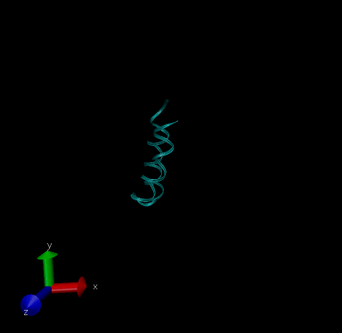

<!-- <a href="https://www.rcsb.org/structure/6OFA"> -->
<!--     </img> -->
<!-- </a> -->
<!--  -->
<!-- <a href="https://www.rcsb.org/structure/6OFA"> -->
<!--     </img> -->
<!-- </a> -->

<a href="https://www.rcsb.org/structure/1aki">
    </img>
</a>
<a href="https://www.rcsb.org/structure/2BEG">
    </img>
</a>
<a href="https://ambermd.org/tutorials/advanced/tutorial2/index.php">
    </img>
</a>

<a href="https://github.com/th2ch-g/qmmm-workshop-chorismate">
    </img>
</a>

<!-- until 837 -->

