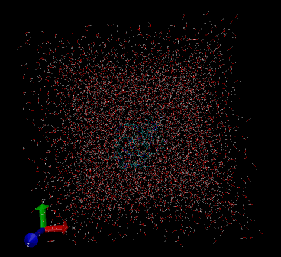

<!-- <a href="https://www.rcsb.org/structure/6OFA"> -->
<!--     </img> -->
<!-- </a> -->
<!--  -->
<!-- <a href="https://www.rcsb.org/structure/6OFA"> -->
<!--     </img> -->
<!-- </a> -->

<!-- <a href="https://www.rcsb.org/structure/2BEG"> -->
<!--     </img> -->
<!-- </a> -->
<!-- <a href="https://ambermd.org/tutorials/advanced/tutorial2/index.php"> -->
<!--     </img> -->
<!-- </a> -->
<!--  -->
<!-- <a href="https://github.com/th2ch-g/qmmm-workshop-chorismate"> -->
<!--     </img> -->
<!-- </a> -->

<table>
  <tr>
    <td></td>
    <td></td>
    <td></td>
  </tr>
  <tr>
    <td></td>
    <td></td>
    <td></td>
  </tr>
  <tr>
    <td></td>
  </tr>
</table>

<!-- until 837 -->

